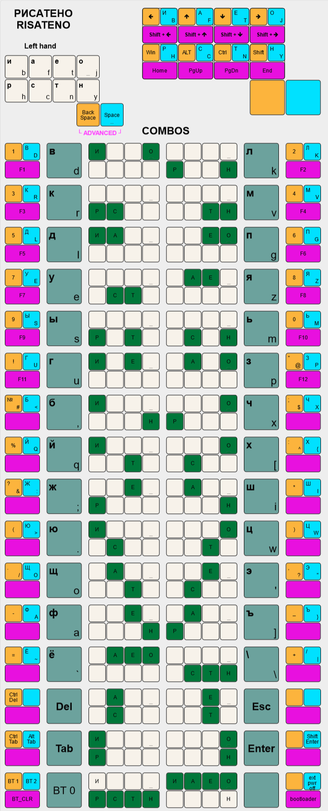
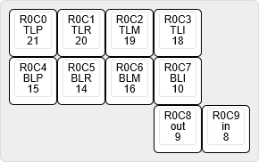

# ZMK Firmware for handwired RISATENO

Used chords by aroum [zmk-PNCATEHO](https://github.com/aroum/zmk-PNCATEHO). Left half only.

Pins optimized for handwired.

Prepared for ZMK Studio.

# Layout

# Pins and fingers

